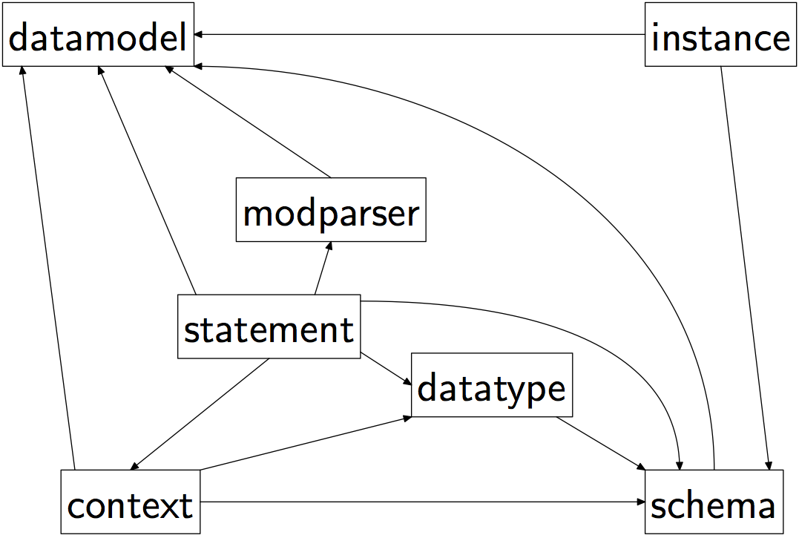

************
Introduction
************

Yangson is a Python library that offers programmers tools for working with
configuration and other data modelled with YANG [Bjo16]_. It is not
intended to aid YANG module development, pyang__ is better suited for
this purpose.

Yangson supports only the JSON data encoding as defined in [Lho16]_.  

__ https://github.com/mbj4668/pyang

Yangson Modules
***************

The Yangson package comprises the following Python modules:

:mod:`datamodel`
    This module defines the *DataModel* class that is designed as the
    main entry point to the library. It allows for composing a data
    model based on YANG library [BBW16]_.

:mod:`schema`
    This module defines a class hierarchy representing YANG schema
    nodes and their properties.

:mod:`datatype`
    This module defines a class hierarchy representing YANG built-in
    and derived types.

:mod:`instance`
    This module defines several classes that implement data instances
    as `persistent structures`_.

:mod:`statement`
    This module defines the :class:`Statement` class that represents a
    generic YANG statement.

:mod:`modparser`
    This module implements a parser for YANG modules and submodules.

:mod:`context`
    This module defines the *Context* class that represents the
    context of the current YANG data model – YANG modules and
    submodules with their revision, namespaces of the (sub)modules,
    and the mapping of namespace prefixes to modules and
    revisions. This context is shared and accessed by several other
    Yangson modules. Only one instance of the *Context* class may
    exist at the same time.

:mod:`typealiases`
    This module defines a number of Python type aliases that can be
    used in type hints [PEP484]_.

:mod:`constants`
    This module defines various constants that are used in other
    modules: base exception class, compiled regular expressions, and
    enumeration classes. 

The modules :mod:`typealiases` and :mod:`constants` are imported by
all other modules. Other import dependencies are indicated in the
following diagram.

Example Data Model
******************

Throughout this documentation, examples will refer to a data model of
the `Turing machine`_. This data model consists of two YANG modules,
``turing-machine.yang`` and ``second-tape.yang`` that are included in
the Yangson package (directory ``examples/turing``). Their complete
listings are also included in :ref:`app-a`.

:ref:`app-b` then shows a JSON-encoded instance document conforming to
the data model. (Guess what this Turing machine “program” actually does.)

.. _persistent structures: https://en.wikipedia.org/wiki/Persistent_data_structure
.. _Turing machine: https://en.wikipedia.org/wiki/Turing_machine
